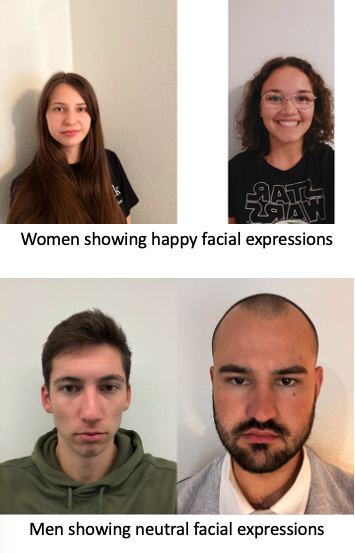
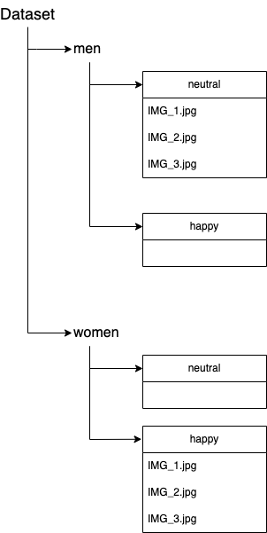
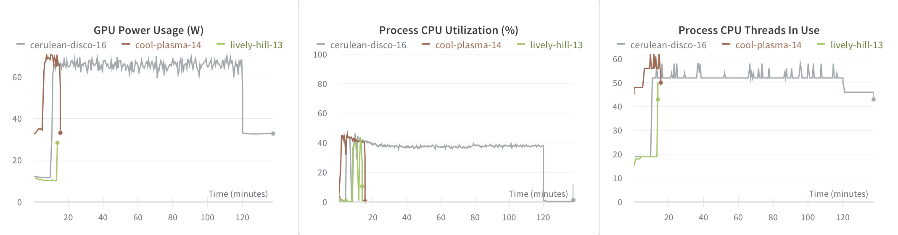
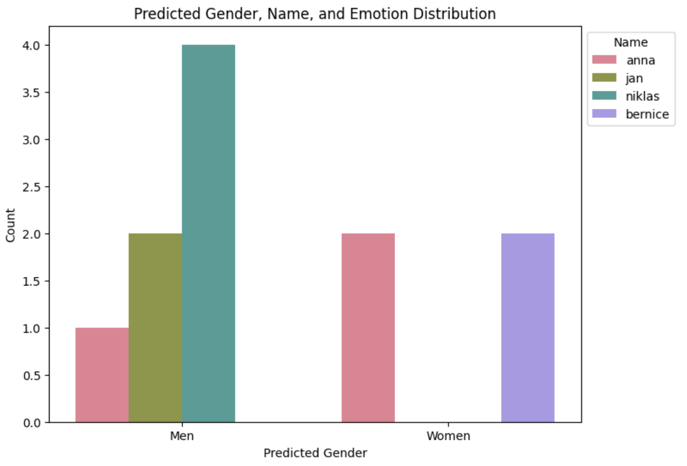

# Bias in Face Recognition
## Project Documentation
 

### Project-Members
- Anna Stöhrer da Silva (ann.stoehrerdasil.23@heilbronn.dhbw.de)
- Bernice Fabich (ber.fabich.23@heilbronn.dhbw.de)
- Jan Schneeberg (jan.schneeberg.23@heilbronn.dhbw.de)
- Niklas Elsaesser (nik.elsaesser.23@heilbronn.dhbw.de)

### University Lecturer
 - Hans Ramsl (hans@wandb.com)

  

## Abstract
Project for the Introduction2DataScience course at the DHBW Heilbronn in the first semester of the first year. Analyzing the sex based bias when training an algorithm on pictures of men and women, in which women smile all the time and men show neutral emotions.

## Table of Contents
- [Abstract](#abstract)
- [Introduction](#introduction)
- [Materials and Methods](#materials-and-methods)
- [Implemented Code](#implemented-code)
- [Results](#results)
- [Conclusion](#conclusion)

## Introduction
Machine Learning Algorithms and Models improve day to day, and especially facial based algorithms are widely used in day to day applications. From unlocking phones to authentication at airports and beauty filter suggestions in apps like "Snapchat". However, this technology is often based on inherited biases, deeply hidden in its design. 

The goal of this project is to test and show this bias in the area of gender and emotion based face recognition.

### Problem:
Face recognition algorithms, paired with sentimental analysis, need to be trained with a great amount of diversified inputs to consistently achieve correct results. A "naturally developing bias" arising from insufficient diversified input is no rare case in machine learning.
 

### Hypothesis:
When testing the trained model on:
- Male faces showing neutral facial expressions
- Female faces showing happy facial expressions

A newly uploaded picture showing either a man with happy facial expressions or a woman with neutral facial expressions, the model will classify the happy man as either neutral or a woman, or the neutral woman as happy or a man. 

## Materials and Methods
Hereby an overview to give a better understanding of the underlying tools and concepts used in this project.
### Google Colaboratory
Google Colaboratory is a Cloud based, Python executing, Jupyter Notebook running interactive development environment. Its big advantage is the free access to Graphics Processing Units (GPU) and Tensor Processing Units (TPU) which allow for an increased computing power when it comes to machine learning, compared to regular computers.[3]

### Wands & Biases
Wands & Biases is a tracking and visualisation platform when doing machine learning experiments. It allows the logging of various parameters and metrics when tracking machine learning trainings. It furthermore allows to visualize and compare results to improve the model and its parameters for better results. To do all of this, its integration into, in this case, Google Colab is seamless and easy.[4]

### Open CV
Open Source Computer Vision Library (OpenCV) is an open source computer vision machine learning library. The algorithm can be used to augment pictures, detect and recognize faces, which is the reason why it was chosen in this project.[5]

## Implemented Code
Collecting pictures of 2 women and 2 men with regular smartphones. Additionally, the collected pictures got augmented to increase and diversify the dataset.

Taking multiple pictures of two women:
- 15 pictures of Anna
- 71 pictures of Bernice

In which they show happy facial expressions. Furthermore, taking multiple pictures of two Men:
- 62 pictures of Jan
- 66 pictures of Niklas

In which they show neutral facial expressions.

The pictures are stored on a Google Drive for easier collaboration between the project members and the seamless integration with Google Colab. 

To increase the dataset, the pictures were augmented in the following parameters:
- **Flip**: Horizontal flipping along the y-axis of the picture to mirror them.[5]
- **Scaling**: Reducing the size of the image by resampling pixels and therefore resulting in a lower quality.[5]
- **Translation**: Moving the picture along its X and Y axis.[5]
- **Noise**: Projecting a matrix of random values, drawn from a Gaussian distribution.[1]
- **Contrast**: Increasing or decreasing *beta* value will add/substract a constant value to every pixel, resulting in a brightened or darkened picture.[8]
- **Brightness**: The *alpha* parameter decreases the contrast if *alpha* < 1 and increase the contrast if *alpha* > 1.[8]

To review the code used for the augmentation, check [augmenting_faces.ipynb](augmenting_faces.ipynb)

**Augmentation** of pictures is used to avoid overfitting. Overfitting describes a problem when ML-Models know their training data too well and achieve poor results on new unknown data. Data augmentation is used in the case of this project, to increase the available data and improve the overall quality of the available data. [1]

### Preprocessing & Labeling
Since the labeling is done via the file structure and not with a labeling tool, the manual work is reduced. Below a picture of the implemented file structure.

In the [FaceBias](FaceBias.ipynb) file under step 4 is the actual code, used to load, prepare and label the pictures. The pictures get read into the code and resized for a uniform data format.

### TensorFlow
Created by the Google Brain Team, TensorFlow ended up as an open source project. By now it is one of the most famous libraries in the machine learning community.[6] It is important to remark that pure TensorFlow is usually not used anymore, but rather used in combination with Keras. Keras uses code that relies on data from several family surveys to determine the risk of delivery. [7]

**Tensors**, the building blocks of TensorFlow are, per definition by Googles TensorFlow team:

> A tensor is a generalization of vectors and matrices to poten- tially higher dimensions. Internally, TensorFlow represents tensors as n-dimensional arrays of base datatypes.

In short, a Tensor is a multidimensional array with some dynamic properties.

A **Flow** describes an underlying graph computation framework which uses tensors for its execution.[2] [6]

#### Convolutional Neural Network
Convolutional Neural Networks (CNNs) are a special class of neural networks that specialize in processing grid data, like image and video. CNNs consist of three distinct layers, as shown in the figure below:

- Convolutional
- Pooling
- Fully connected

The **Convolutional** layer applies one or more filters to an input (image). The filter is a matrix of integers used on a subset of the input, the same size as the filter. [2] [6] The convolutional layer can furthermore extract local features and needs less parameters than a dense layer. [2] [9]
 [7]

The **Pooling** layer reduces the dimensionality of the input features and therefore the complexity of the model and follows each convolutional layer. Additionally, the pooling layer is used to reduce the convolutional layer's output to avoid overfitting. The pooling layer is also shown in the picture above. [6] [9]

In the **Fully Connected** (FC) layer, at least one, the neurons have a complete connection to all activations from the previous layers. [6] The result is that every portion of the output is linked to the input via the *Convolutional* layer. [7] The FC layer aggregates the global information and returns a vector in the size of the number of categories. [6]

### Training
In the [FaceBias.ipynb](FaceBias.ipynb) under step 6 the model is trained to recognize faces and match the labels (emotion, gender).\
The algorithm uses a sequential model, where each layer has one input and one output layer. It uses 2 *2D-Convolutional* layers to be able to learn more complex and abstract features. The first *2D-Convolutional* layer captures basic patterns and features from the 48X48 scaled, gray picture. The second layer captures the more complex features with 128 filters with a size of 3x3. Stacking multiple *2D-Convolutional* layers improves the models ability to understand the underlying data and therefore leads to a better performance. [6] [9]

Each *2D-Convolutional* layer is followed by a max-pooling layer. A max-pooling layer reduces overfitting and improves computational efficiency.[6] They help to capture the most at different levels of abstraction, by reducing the spatial dimensions it allows the model to focus on the more prominent features. It furthermore reduces the spatial dimensions of the feature maps and therefore the parameters in the following layer, shortening the training process and decreasing the complexity of the training process.[9]

To track the whole training process a callback to Weights&Biases (WandB) is made. WandB allows for comprehensive data review to improve the training process if needed. In case of this project, various Epoch sizes made a significant difference in computing power, not recognizable without WandB.

As visible in the charts above, the 3 runs differ in some parameters in which a difference is expected but in some parameters not really. The training was altered for all three runs in the Epoch size:

- Run 1 "lively-hill-13" with an Epoch size of 10
- Run 2 "cool-plasma-14" with an Epoch size of 1000
- Run 3 "cerulean-disco-16" with an Epoch size of 10000

The *GPU Power Usage (W)* was quite low for Run 1 compared to Run 2 and Run 3, where Run 2 and 3 peaked at the pretty much same amount of Power Usage although Run 2 ended earlier due to the lower Epoch size.

*Process CPU Utilization (%)* showed the same overall pattern as the GPU Power Usage with the only difference that Run 1 peaked at the same percentage.

*Process CPU Threads in Use* shows the most interesting results:
- Run 1 resulted in an Epoch 10 related result, being fast and easy.
- Run 2 ended nearly equally fast as Run 1 but maxed out above Run 3 and started with more Threads in Use compared to the other Runs.
- Run 3 started with the same amount of threads as Run 1, maxed out below Run 2 but held its level the longest, caused by its larger Epoch size of 10000.

To conclude, the tracking with WandB resulted in interesting insights by which the training could have been improved, while saving on power, memory and increasing efficiency.

### Testing
To test the functionality of the model, multiple new pictures of the project members got tested by the model. To check for the bias, women and men now showed both facial expressions and the result was safed to a dataframe. To check for the right prediction, the dataframe got a new column where the result of the prediction was flagged as *Correct* or *Incorrect*.

The resulting dataframe was used as a basis for further analysis. To review the code used for testing see: [bias_testing.ipynb](bias_testing.ipynb) on GitHub.

### Results
The biased was tested via 3 trained models, one with an:

- Epoch size of 10
- Epoch size of 1000
- Epoch size of 10000

The results varied significantly and showed some bias.

**Model One** with an Epoch size of 10 showed the following results:

|**Image Path**                |**Predicted Gender**|**Predicted Emotion**|**Correct Prediction**|
|------------------------------|--------------------|---------------------|----------------------|
|anna_happy_2.jpg          |Women               |Happy                |Correct               |
|anna_neutral.jpg          |Men                 |Neutral              |Incorrect             |
|anna_neutral_2.jpg        |Women               |Happy                |Incorrect             |
|bernice_happy.jpg         |Women               |Happy                |Correct               |
|bernice_neutral.jpg       |Women               |Happy                |Incorrect             |
|jan_happy.jpg             |Men                 |Neutral              |Incorrect             |
|jan_neutral.jpg           |Men                 |Neutral              |Correct               |
|niklas_happy_1.jpg        |Men                 |Neutral              |Incorrect             |
|niklas_happy_woBeard.jpg  |Men                 |Neutral              |Incorrect             |
|niklas_neutral_1.jpg      |Men                 |Neutral              |Correct               |
|niklas_neutral_woBeard.jpg|Men                 |Neutral              |Correct               |

The model predicted men no matter their emotion as men, but declared them showing neutral facial expression even when showing happy facial expressions, the overall misprediciton rate for men was at 57.14 %. The resulting bias was due to undiversified and underlabeld data.

Women, on the other hand were declared as men in one case (anna_neutral.jpg), most likely due to tug back hair and the necessary neutral facial expression. This combination allowed for the most extreme case of bias. Interestingly, in another case (anna_neutral_2.jpg) in which she showed neutral facial expressions, she was labeled as a *Happy Women*. In conclusion women were mispredicted 50 % of the time overall, in the obvious case in which they showed neutral facial expressions. The resulting bias was caused by undiversified, underlabeld data and a meta-parameter change. To combat this bias a more diversified dataset is necessary, in which meta-parameter changes have to be included (like long or short hair).

The Chart shows the predictions, Anna was once labeled as a Man, but Men were never labeled as Women. The spike for Niklas in the Men group was due to more testing data (Pictures with and without a Beard).

**Model Two** with an Epoch size of 1000 came to the same result as *Model One* except for one case, in which it labeled anna_happy_2 as Man showing neutral emotions. This prediction was most likely caused because Annas hair was tugged behind her head. Therefore, the result can be attributed to a slight bias against women in favor of male faces.

**Model Three** with an Epoch size of 10000 predicted everybody as a Woman showing happy emotions. This prediction was only right in 16 % of cases or for only 3/18 pictures the right prediction. The cause for this result originates from a variety of reasons:

- The extracted Features to differentiate between the faces might not have been robust enough.
- The complexity of the algorithm, in this case the amount of Convolutional layers used might have been not enough.
- The Epoch size of 10000 caused overfitting.

A definitive answer for this result was not found nor subject of this project. The problem has to be evaluated in future projects and scenarios.

## Conclusion
The results show a clear bias towards the training data. Men showing happy or neutral facial expressions were consistenly classified as male. The model associated the male attribute always with neutrality, thus failing to identify emotional happiness in men. Caused by lack of training data and insufficient labeling.

A similar pattern emerged for women, showing neutral facial expressions. Since the algorithm had been exclusively trained on women showing happy facial expressions, it linked the female gender to happiness. This was caused by the same problem as for men.

This project showed that it is important to not only include every attribute (male/female, neutral/happy) but to also make sure that every attribute is represented in relation to its counterparts.

The results show how important a diversified, properly labeled and extensive dataset is, when it comes to machine learning. 

## Citations
[1] Khoshgoftaar, Taghi M.. "A survey on Image Data Augmentation for Deep Learning". [doi](https://doi.org/10.1186/s40537-019-0197-0).  2019.[Journal]\
[2] Yan, Wei Qi. "Computational Methods for Deep Learning: Theory, Algorithms, and Implementations". 2023.[Book]\
[3]Google. "Colaboratoy FAQ". [Site](https://research.google.com/colaboratory/faq.html). 2023.[FAQ]\
[4]WandB. "Website". [Weights&Biases](https://wandb.ai/site). 2023.[Site]\
[5]OpenCV. "About". [OpenCV](https://opencv.org/about/). 2023.[Site]\
[6]Singh, Pramod and Manure, Avinash. "Learn TensorFlow 2.0: implement machine learning and deep learning models with Python". 2020 [Book]\
[7]Mukhopadhyay, Sayan. "Advanced Data Analytics Using Python: With Architectural Patterns, Text and Image Classification, and Optimization Techniques". 2023.[Book]\
[8]OpenCV, "Changing the contrast and brightness of an image!", [OpenCV](https://docs.opencv.org/3.4/d3/dc1/tutorial_basic_linear_transform.html), 2023.[Site]\
[9]Liu, Yipeng and Liu, Jiani and Long, Zhen and Zhu, Ce. "Tensor Computation for Data Analysis". 2022. [Book]
