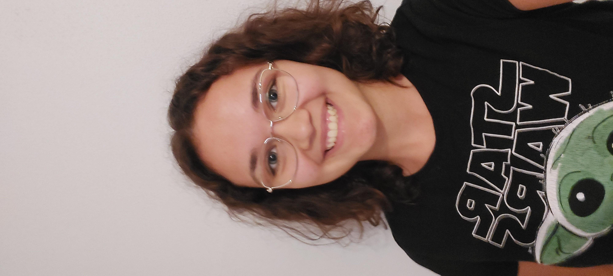
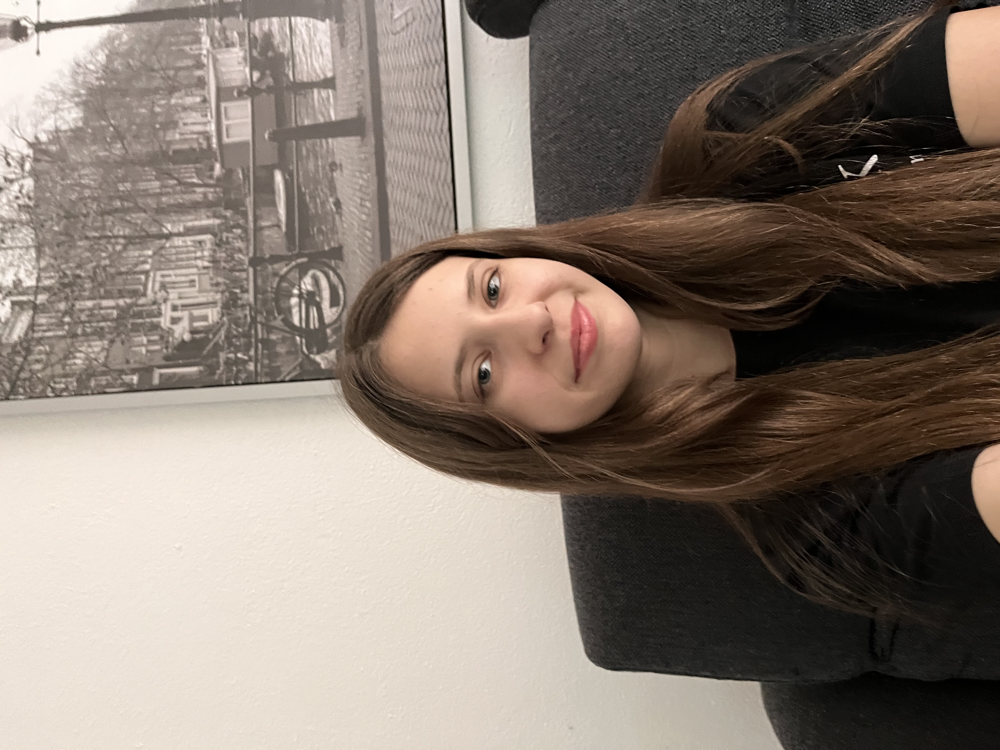

# Bias in Face Recognition
### Project Documentation

 

### Project-Members
- Anna Stöhrer da Silva 
- Bernice Fabich
- Jan Schneeberg
- Niklas Elsaesser

### University Lecturer
 - Hans Ramsl (hans@wandb.com)

  

## Abstract
Project for the Introduction2DataScience Course at the DHBW Heilbronn with Face Recognition. Analyzing the sex based bias when we train the algorithm on Pictures of men and woman, where woman smile all the time and men show neutral emotions.

## Table of Contents
- [Abstract](#abstract)
- [Introduction](#introduction)
- [Materials and Methods](#materials-and-methods)
- [Implemented Code](#implemented-code)
- [Training](#training)
- [Results](#results)
- [Conclusion](#conclusion)

## Introduction
Machine Learning Algorithms and Models improve day to day and especially facial based Algorithms are widely used in day to day applications. From unlocking phones to authentication at airports and beauty filter suggestions in Apps like Snapchat. However, this technology is often based on inherited biases, deeply hidden in its design. 

 but humanbased input is still key for good training.

 If the provided Data or the labeling process were insufficient, the outcome will be lackluster.

### Problem:
Evaluating the Bias of a face recognition algorithm based on insufficient diversified input, when men are only shown as neutral and woman as emotional i.e. smiling.
 

### Hypothesis:
When we test the trained model on:
- male faces showing neutral facial expressions
- female faces showing happy facial expressions

A newly uploaded picture showing a men with happy facial expressions or a woman with neutral facial expressions, the model will classify the male picture as female and opposite.

## Materials and Methods
*Ausgehend von der Aufgabenstellung ist der derzeitige Stand der Technik für die Lösungsfindung zu beschreiben. Es sind z.B. die Vor- und Nachteile bisheriger Lösungen bzw. fundamentaler Lösungsprinzipien fundiert von und ggf. anderen Quellen darzulegen.*

***Description of:***

### Google Colab

### Wands & Biases

### Open CV

### Numpy

### Tensorflow / Keras @Niklas

#### Convolutional Neural Network (CNN)

## Implemented Code
Collecting pictures of initially 2 woman and 2 men, for a more diversified algorithm, pictures of another men and female were added. Additionally the collected pictures got their parameters changed, to increase the dataset even more.

Taking multiple pictures of two Woman:
- 20 Pictures of Anna
- 71 Pictures of Bernice

in which they smile (happy facial expressons). Furthermore taking multiple Pictures of two Men
- 62 Pictures of Jan
- 66 Pictures of Niklas

in which they shownneutral facial expressions.

<figure align="middle" alt="hfe">
  
  
  <figcaption align="middle">Happy Facial Expressions</figcaption>
</figure>
<figure align="middle">
    
    
    <figcaption align="middle">Neutral Facial Expressions</figcaption>
</figure>

The pictures are stored on a 
<figure align="middle">
    
    <figcaption align="middle">Folder Structure</figcaption>
</figure>

[folderstruct]: drawio/Unbenanntes%20Diagramm.drawio-2.png "Folder Structure" 
![FolderStructure][folderstruct] 
A reference to the [1](#folderstruct).

To increase the dataset, the pictures were augmented in the following parameters:
- **Flip**: 
- **Scaling**:
- **Translation**:
- **Noise**:
- **Colour**:
- **Brightness**:

Augmentation of pictures is used to avoid overfitting. Overfitting describes a problem when ML-Models know their training data too well and achieve poor results on new unknown data. Data Augmentaition is used in the case of this project, to increase the availbale data and improve the overall quality of it. [1] 

<figure align="middle" alt="hfe">
  
  
  <figcaption align="middle">Happy Facial Expressions</figcaption>
</figure>
<figure align="middle">
    
    
    <figcaption align="middle">Neutral Facial Expressions</figcaption>
</figure>

### Training
Labeling is done via the file structure, as seen in this picture below: 

In the [FaceBias](FaceBias.ipynb) file under step 4 is the actual code, used to label the pictures.

*preprocessing*\
*training*\
*testing*

### Results

## Conclusion

## Citations
[1] Khoshgoftaar, Taghi M. "A survey on Image Data Augmentation for Deep Learning", [doi](https://doi.org/10.1186/s40537-019-0197-0),  2019. [Journal]\
[1] Mainzer, Klaus. "Quantencomputer: von der Quantenwelt zur Künstlichen Intelligenz", 2020. [Book]\
