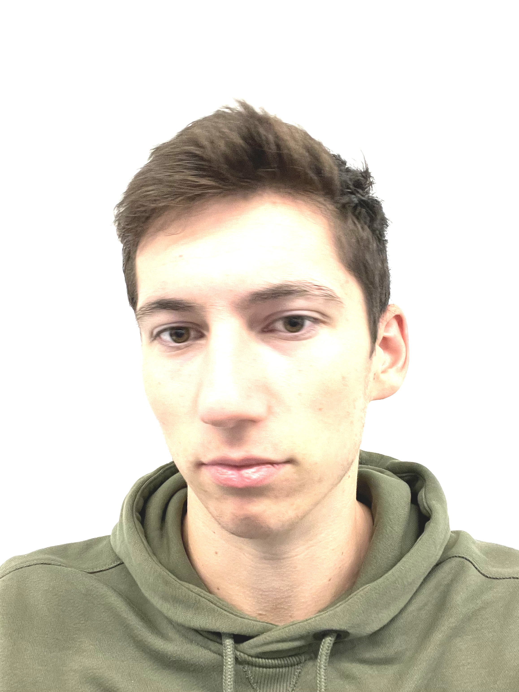
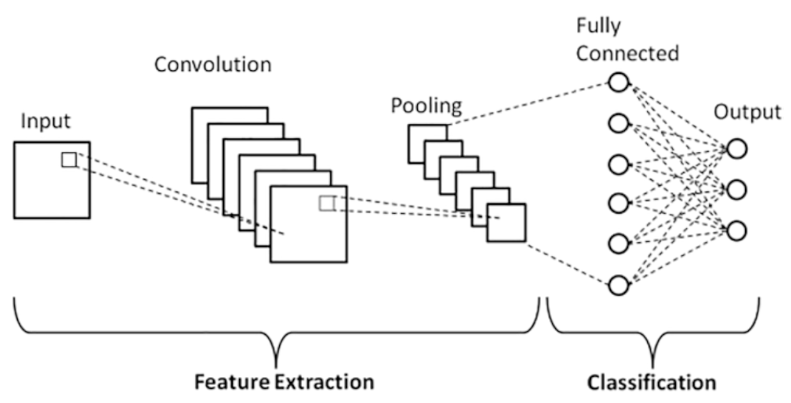

# Bias in Face Recognition
### Project Documentation

 

### Project-Members
- Anna Stöhrer da Silva 
- Bernice Fabich
- Jan Schneeberg
- Niklas Elsaesser

### University Lecturer
 - Hans Ramsl (hans@wandb.com)

  

## Abstract
Project for the Introduction2DataScience Course at the DHBW Heilbronn with Face Recognition. Analyzing the sex based bias when we train the algorithm on Pictures of men and woman, where woman smile all the time and men show neutral emotions.

## Table of Contents
- [Abstract](#abstract)
- [Introduction](#introduction)
- [Materials and Methods](#materials-and-methods)
- [Implemented Code](#implemented-code)
- [Training](#training)
- [Results](#results)
- [Conclusion](#conclusion)

## Introduction
Machine Learning Algorithms and Models improve day to day and especially facial based Algorithms are widely used in day to day applications. From unlocking phones to authentication at airports and beauty filter suggestions in Apps like Snapchat. However, this technology is often based on inherited biases, deeply hidden in its design. 

 but humanbased input is still key for good training.

 If the provided Data or the labeling process were insufficient, the outcome will be lackluster.

### Problem:
Evaluating the Bias of a face recognition algorithm based on insufficient diversified input, when men are only shown as neutral and woman as emotional i.e. smiling.
 

### Hypothesis:
When we test the trained model on:
- male faces showing neutral facial expressions
- female faces showing happy facial expressions

A newly uploaded picture showing a men with happy facial expressions or a woman with neutral facial expressions, the model will classify the male picture as female and opposite.

## Materials and Methods
Hereby an overview to give a better understanding of the underlying tools and concepts used in this project.
### Google Colaboratory
Google Colaboratory is a Cloud based, Python executing, Jupyter Notebook running interactive development environment. Its big advantage is the free access to Graphics Processing Units (GPU) and Tensor Processing Units (TPU) which allow for an increased computing power when it comes to machine learning, compared to regular computers.[3]

### Wands & Biases
Wands & Biases is a tracking and visualisation platform when doing machine learning experiments. It allows the logging of various parameters and metricks when tracking machine learning trainings. It furthermore allows to visualize and compare results to improve the model and its parameters for better results. To do all of this its integration into, in this case, Google Colab is seamless and easy.[4]

### Open CV
Open Source Computer Vision Library (OpenCV) is an open source computer vision machine learning library. The algorithm can be used to augment pictures, detect and recognice faces, which is the reason why it was chosen in this project.[5]

## Implemented Code
Collecting pictures of initially 2 woman and 2 men, for a more diversified algorithm, pictures of another men and female were added. Additionally the collected pictures got their parameters changed, to increase the dataset even more.

Taking multiple pictures of two Woman:
- 20 Pictures of Anna
- 71 Pictures of Bernice

in which they smile (happy facial expressons). Furthermore taking multiple Pictures of two Men
- 62 Pictures of Jan
- 66 Pictures of Niklas

in which they shownneutral facial expressions.

<figure align="middle" alt="hfe">
  
  
  <figcaption align="middle">Happy Facial Expressions</figcaption>
</figure>
<figure align="middle">
    
    
    <figcaption align="middle">Neutral Facial Expressions</figcaption>
</figure>

The pictures are stored on a Google Drive for easier collaboration between the project members and the seamless integration with Google Colab. 

To increase the dataset, the pictures were augmented in the following parameters:
- **Flip**: Horizontal flipping of the picture to mirror it.[5]
- **Scaling**: Reducing the size of the image by resampling pixels and therefore resulting in a lower quality.[5]
- **Translation**: Moving the picture along its X and Y Axis.[5]
- **Noise**: Projecting a Matrix of random values, drawn from a Gaussian distribution.[1]
- **Contrast**: Increasing or decreasing *beta* value will add/substract a constant value to every pixel, resulting in a brightened or darkened picture.[8]
- **Brightness**: The *alpha* parameter decreases the contrast if *alpha* < 1 and increase the contrast if *alpha* > 1.[8]

To review the code used for the augmentation, check [augmenting_faces.ipynb](augmenting_faces.ipynb)

Augmentation of pictures is used to avoid overfitting. Overfitting describes a problem when ML-Models know their training data too well and achieve poor results on new unknown data. Data Augmentaition is used in the case of this project, to increase the availbale data and improve the overall quality of the available data. [1] 

<figure align="middle" alt="hfe">
  
  
  <figcaption align="middle">Augmented Happy Facial Expressions</figcaption>
</figure>
<figure align="middle">
    
    
    <figcaption align="middle">Augmented Neutral Facial Expressions</figcaption>
</figure>

### Training
Since the labeling is done via the file structure and not with a labeling tool, the manual work is reduced. Below a picture of the implemented file structure.

Labeling is done via the file structure, as seen in this picture below:\

In the [FaceBias](FaceBias.ipynb) file under step 4 is the actual code, used to label the pictures.

To load and prepare the data [FaceBias](FaceBias.ipynb) in step 4 get pictures get read into the code and resized for an uniform data format.

*training*\

### TensorFlow / Keras @Niklas
Created by the Google Brain Team TensorFlow is now an open source project. By now it is one of the most famous libraries in the machine learning community.

 **Tensors**, the building blocks of TensorFlow are, per definition by Googles TensorFlow team:

> A tensor is a generalization of vectors and matrices to poten- tially higher dimensions. Internally, TensorFlow represents tensors as n-dimensional arrays of base datatypes.

In short, a Tensor is a multidimensional array with some dynamic properties.

A **Flow** describes an underlying graph computation framework which uses tensors for its execution.[6]

#### Convolutional Neural Network
Convolutional Neural Networks (CNNs) are a special class of neural networks that specializes in processing grid data, like image and video. CNNs consist of three distinct layers, as shown in the figure below:

- Convolutional
- Pooling
- Fully connected

The **Convolutional** layer applies one or more filters to an input (image). The filter is a matrix of integers used on a subset of the input, the same size as the filter. This layer distinguishes CNNs from other neural networks.[6]
[7]

The **Pooling** layer reduces the dimensionality of the input features and therefore the complexity of the model, also shown in the picture above.[6] 

In the **Fully Connected** layer the neurons have complete connection to all activations from the previous layers.[6] The result is that every portion of the output is linked to the input via the *Convolutional* layer.[7]

*testing*
[bias_testing.ipynb](bias_testing.ipynb)

### Results

## Conclusion

## Citations
[1] Khoshgoftaar, Taghi M., "A survey on Image Data Augmentation for Deep Learning", [doi](https://doi.org/10.1186/s40537-019-0197-0),  2019.[Journal]\
[2] Mainzer, Klaus, "Quantencomputer: von der Quantenwelt zur Künstlichen Intelligenz", 2020.[Book]\
[3]Google, "Colaboratoy FAQ", [Site](https://research.google.com/colaboratory/faq.html), 2023.[FAQ]\
[4]WandB, "Website", [Weights&Biases](https://wandb.ai/site), 2023.[Site]\
[5]OpenCV, "About", [OpenCV](https://opencv.org/about/), 2023.[Site]\
[6]@misc {noauthor2020NeuronaleNetze,
title = {Neuronale Netze programmieren mit Python},
editor = {Steinwendner, Joachim [Verfasser/in] and Schwaiger, Roland [Verfasser/in]},
series = {Rheinwerk Computing},
address = {Bonn},
publisher = {Rheinwerk Verlag},
year = {2020},
edition = {2., aktualisierte und überarbeitete Auflage},
isbn = {978-3-8362-7452-4},
isbn = {9783836274500 (Druck-Ausgabe)},
isbn = {9783836274500 (Sekundärausgabe)},
language = {Deutsch},
keywords = {Neuronales Netz. Programmierung. Python / Programmiersprache. Programmiersprache. Maschinelles Lernen. TensorFlow. Neuronales Netz. Programmiersprache. Deep learning. Python 3.x},
note = {1 Online-Ressource (479 Seiten)},
abstract = {Neuronale Netze stehen im Mittelpunkt, wenn es um Künstliche Intelligenz und Machine Learning geht. Sie revolutionieren Bild- und Spracherkennung, Spiele-KIs und vieles mehr. Zum Glück lassen sich die genialen Ideen dahinter einfach erklären. Um sie zu verstehen und einzusetzen, programmieren Sie verschiedene Netztypen selbst nach! Und zwar in Python, der Hauptsprache der KI-Welt. Sie werden sich dabei mit Mathematik und Programmierung befassen, brauchen aber keine konkreten Vorkenntnisse.},
note = {Description based on publisher supplied metadata and other sources.},
}\
[7]@misc {Mukhopadhyay2023AdvancedData,
author = {Mukhopadhyay, Sayan},
title = {Advanced Data Analytics Using Python: With Architectural Patterns, Text and Image Classification, and Optimization Techniques},
editor = {Samanta, Pratip [Verfasser/in]},
address = {Berkeley, CA},
publisher = {Apress},
year = {2023},
edition = {2nd ed. 2023.},
isbn = {978-1-4842-8005-8},
isbn = {9781484280041, 9781484280065 (Sekundärausgabe)},
language = {Englisch},
keywords = {Artificial intelligence—Data processing.. Machine learning.. Python (Computer program language).. Artificial intelligence.},
note = {1 Online-Ressource(XVII, 249 p. 32 illus.)},
abstract = {Chapter 1: Overview of Python Language -- Chapter 2: ETL with Python -- Chapter 3: Supervised Learning and Unsupervised Learning with Python -- Chapter 4: Clustering with Python -- Chapter 5: Deep Learning & Neural Networks -- Chapter 6: Time Series Analysis -- Chapter 7: Analytics in Scale.},
abstract = {Understand advanced data analytics concepts such as time series and principal component analysis with ETL, supervised learning, and PySpark using Python. This book covers architectural patterns in data analytics, text and image classification, optimization techniques, natural language processing, and computer vision in the cloud environment. Generic design patterns in Python programming is clearly explained, emphasizing architectural practices such as hot potato anti-patterns. You'll review recent advances in databases such as Neo4j, Elasticsearch, and MongoDB. You'll then study feature engineering in images and texts with implementing business logic and see how to build machine learning and deep learning models using transfer learning. Advanced Analytics with Python, 2nd edition features a chapter on clustering with a neural network, regularization techniques, and algorithmic design patterns in data analytics with reinforcement learning. Finally, the recommender system in PySpark explains how to optimize models for a specific application. You will: Build intelligent systems for enterprise Review time series analysis, classifications, regression, and clustering Explore supervised learning, unsupervised learning, reinforcement learning, and transfer learning Use cloud platforms like GCP and AWS in data analytics Understand Covers design patterns in Python .},
}\
[8]OpenCV, "Changing the contrast and brightness of an image!", [OpenCV](https://docs.opencv.org/3.4/d3/dc1/tutorial_basic_linear_transform.html), 2023.[Site]\