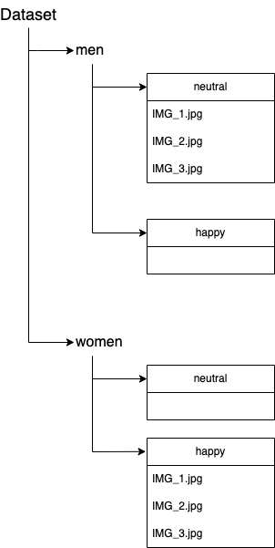

# Filestructure
**Prerequisits**
- Google Drive Account
- Google Colaboratory (Colab) Account
- Weights & Biases (WandB) Account

Since the used code was executed in Google Colab, it is necessary that the pictures used to train the model are organized in a folder structure on a Google Drive, as shown in the picture below.

The Dataset gets extendend after the augmentation of the pictures, it might be necessary to alter the code to show this change.

# Augmenting
Following the steps in the [augmenting_faces.ipynbs](augmenting_faces.ipynb). Mainly making sure that the file paths point to the right folder.
# Training
[FacesBias.ipynb](FacesBias.ipynb) is mostly self explanatory. Altough for the tracking with WandB it is necessary to have an account for tracking and evaluation purposes.
Againg checking for the correct file path and the desired name under which the model is supposed to be saved and in which folder.
# Testing
Testing is done in the [bias_testing.ipynb](bias_testing.ipynb) notebook. It is important that the correct folder path is chosen and a folder with pictures for testing is prepared. It is also possible to test single pictures manually. To do so the commented code in Code Box one has to be uncommented and the path to the desired picture must declared.

To connect a potential bias with the predictions the results need to be checked for in Step 3.